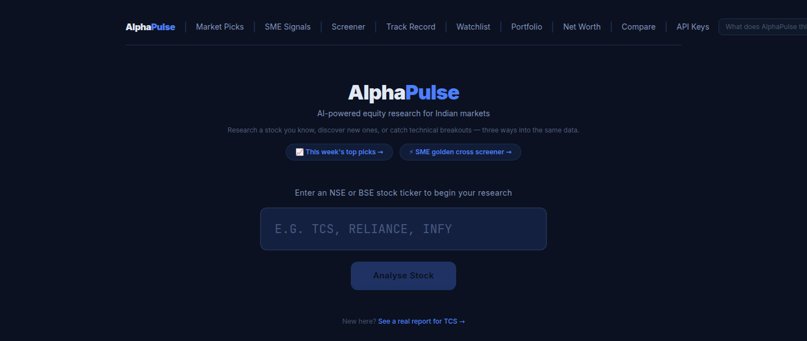
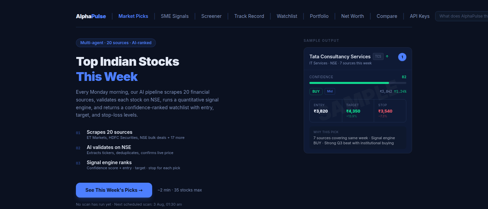
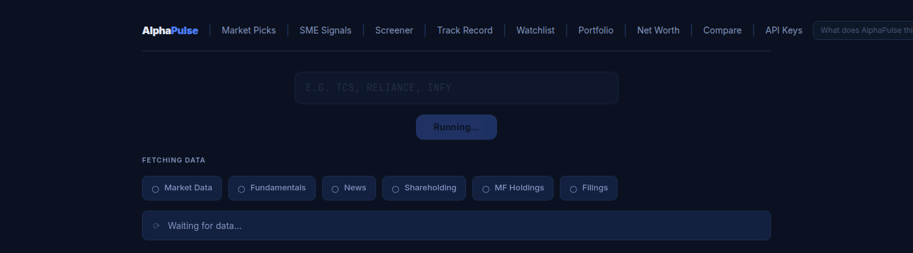
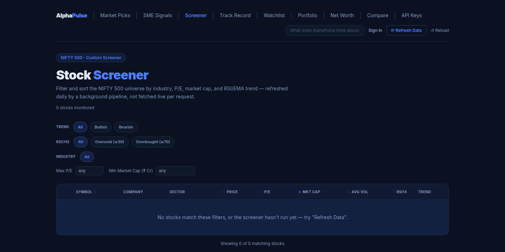

# AlphaPulse

[](https://github.com/luckyrjain/stock-research/actions/workflows/ci.yml)


[](LICENSE)

**AlphaPulse** is an AI-powered Indian equity research platform. It combines a deterministic
quantitative signal engine with an LLM analyst to turn an NSE/BSE ticker into an explainable
BUY/HOLD/SELL recommendation — instead of manually cross-referencing fundamentals, news, filings,
and technicals across half a dozen sites, AlphaPulse runs that workflow for you and streams the
result live.

Point it at a ticker (e.g. `TCS`, `RELIANCE`) and it validates the symbol, fetches six data slices
in parallel (price, fundamentals, news, shareholding, MF holdings, filings), scores them through a
quant signal engine (valuation + growth + volume + filings + technical + macro), and calls an LLM
for a structured verdict — all streamed to the browser over Server-Sent Events.

## Who it's for

- **Retail investors** who want a fast, sourced BUY/HOLD/SELL read on a specific stock without
  stitching together a broker app, Screener.in, and news by hand.
- **Screener/discovery users** who want a ranked, cross-source weekly shortlist instead of reading
  broker notes one at a time.
- **Momentum/technical traders** working the NSE Emerge + BSE SME segment, which mainstream
  screeners cover thinly.
- **Active portfolio trackers** who want starred stocks and logged buys rolled up into aggregate
  P&L without a brokerage integration.
- **Personal finance trackers** who want one net-worth view across stocks, mutual funds, FDs, and
  EPF/PPF, built from imported statements rather than re-typed by hand.

*(This isn't a brokerage — there's no order placement or live trading. See
[Security & scope](#security--scope) below.)*

## What it does

**Research**
- **Stock Analysis** — full single-stock report: quant signals (valuation, growth, technical,
  macro) + LLM verdict, peer comparison, DCF, verdict-history win-rate.
- **Compare** — two stock analysis reports side by side.
- **Consolidated search** — "what does AlphaPulse think about X" in one query, aggregating
  whatever the other modes have already cached for that symbol.

**Discovery**
- **Market Picks** — multi-agent pipeline scraping 20 Indian/global sources into a
  confidence-ranked, sector-balanced weekly watchlist.
- **SME Signals** — batch screener for EMA20/EMA50 golden-cross/death-cross events across NSE
  Emerge + BSE SME stocks.
- **Screener** — filterable NIFTY 500 screener (industry, P/E, market cap, RSI/EMA trend).

**Portfolio**
- **Watchlist** — cross-mode watchlist shared across Stock Analysis, Market Picks, and Screener.
- **"I bought this" positions** — logged buys tracked against live prices.
- **Portfolio Aggregator** — separate personal net-worth tracker (stocks, MFs, FDs, EPF/PPF) with
  an XIRR engine, fed by CAS PDF / broker CSV import.

**Automation**
- **Daily email alerts** — a batch job re-analyses every signed-in user's watchlist symbol and
  emails a digest when a stock's recommendation changes.
- **Magic-link accounts** — passwordless sign-in ties watchlist/positions to an account instead of
  an anonymous per-browser id.

## Screenshots

Captured from a running instance — a fresh local install looks like this before any batch
pipeline has populated data or an LLM key is configured (a HOLD-fallback verdict, disclosed as
such, stands in for a real analyst call when no provider key is set).

| | |
|---|---|
|  Home — enter a ticker, or jump into Market Picks / SME Signals |  Market Picks — the built-in sample card shown before the first weekly scan runs |
|  Stock Analysis — six data slices streamed live over SSE |  Screener — NIFTY 500, filterable by industry/P-E/market cap/RSI-EMA trend |

## Architecture

```text
                     ┌────────────────┐
   Browser  ───────▶ │   Next.js UI   │
                     └───────┬────────┘
                             │  REST + Server-Sent Events
                     ┌───────▼────────┐
                     │  FastAPI (SSE) │
                     └───────┬────────┘
              ┌──────────────┼──────────────┐
     ┌────────▼───────┐ ┌────▼─────┐ ┌──────▼───────┐
     │ Signal engine   │ │   LLM    │ │  Scrapers /  │
     │ (quant, sync)   │ │ analyst  │ │  batch jobs  │
     └────────┬────────┘ └────┬─────┘ └──────┬───────┘
              └──────────────┼──────────────┘
                              │
                      ┌───────▼────────┐
                      │  PostgreSQL    │  (only datastore; Redis optional,
                      │  + file cache  │   only for multi-worker deployments)
                      └────────────────┘
```

One FastAPI + Next.js monolith, `ThreadPoolExecutor` for in-process parallelism, GitHub Actions
cron for scheduled jobs — deliberately, see [Architectural constraints](CLAUDE.md#architectural-constraints--binding)
for why.

## Tech stack

- **Backend** — Python 3.13, FastAPI (SSE streaming), litellm, a custom quantitative signals engine
- **Frontend** — Next.js 15 (App Router), React 19, TypeScript (strict), Tailwind CSS v3, PWA
- **Storage** — PostgreSQL (primary store for all durable/shared state); Redis optional, only for
  multi-worker deployments
- **LLM providers** — Anthropic, OpenAI, Groq, Google, OpenRouter, or local Ollama (auto-detected
  from whichever API key is set, with cross-provider failover)
- **Data sources** — Yahoo Finance, Screener.in, NSE/BSE, AMFI, Trendlyne, RBI, Google News/RSS

## Project structure

```text
stock-research/
├── backend/       FastAPI app, batch pipelines, signal engine, tests — see backend/CLAUDE.md
├── frontend/      Next.js app (App Router), Playwright E2E — see frontend/CLAUDE.md
├── docs/          setup, architecture, API reference, database schema, deployment, PRD
├── docker-compose.yml
└── CLAUDE.md
```

## Quickstart

**Requirements:** Docker + Docker Compose (or, for manual setup: Python 3.13, Node.js 18+, npm),
and at least one LLM provider API key (Anthropic, OpenAI, Groq, Google, OpenRouter — or a local
Ollama install, no key needed).

```bash
git clone <repo> && cd stock-research
cp .env.example .env   # add at least one LLM provider key
docker compose up --build
docker compose exec backend alembic upgrade head   # first run only
```

Backend on `http://localhost:8000`, frontend on `http://localhost:3000`.

<details>
<summary>Manual setup (no Docker)</summary>

**Prerequisites:** Python 3.13, Node.js 18+, npm (not yarn/pnpm), one configured LLM provider key.
PostgreSQL is optional for single-stock analysis but required for every other mode.

```bash
make setup   # creates .venv, installs backend+frontend deps, copies .env.example -> .env
make check   # verifies Python/Node/npm/.env/DB/Redis are all in place
```

Edit `.env` with your provider key. If `DATABASE_URL` is set, run the migration once:

```bash
cd backend && alembic upgrade head && cd ..
```

Run it:

```bash
# Terminal A
source .venv/bin/activate && cd backend && uvicorn api:app --reload --port 8000

# Terminal B
cd frontend && npm run dev
```

Single-stock CLI (no server): `cd backend && python main.py TCS`

See [docs/setup.md](docs/setup.md) for full env var reference and troubleshooting, and
`backend/CLAUDE.md`'s "Schema migrations" section for the existing-database (pre-Alembic) upgrade
path.

</details>

### Key environment variables

Full reference: [docs/setup.md](docs/setup.md). The essentials:

| Variable | Required? | Purpose |
|---|---|---|
| One of `ANTHROPIC_API_KEY` / `OPENAI_API_KEY` / `GROQ_API_KEY` / `GOOGLE_API_KEY` / `OPENROUTER_API_KEY` | Yes, at least one (or a local Ollama install) | LLM analyst calls |
| `DATABASE_URL` | Required for every mode except single-stock analysis | PostgreSQL connection string |
| `REDIS_URL` | Optional | Shared rate-limit/concurrency state across multiple backend workers only |
| `SMTP_HOST` + related `SMTP_*` | Optional | Sends magic-link sign-in + watchlist-alert emails; without it, links are generated but not emailed |
| `SENTRY_DSN` | Optional | Forwards error-level logs to a Sentry-compatible endpoint |

## Tests

```bash
make test        # backend pytest + frontend tsc --noEmit
make test-e2e     # frontend Playwright e2e (installs Chromium on first run)
```

Equivalent, run directly:

```bash
cd backend && python -m pytest tests/       # no live network calls
cd frontend && npx tsc --noEmit && npm run test:e2e   # Playwright, backend fully mocked
```

## Security & scope

- **No live trading or brokerage execution.** This is a research and tracking tool — it never
  places an order.
- **No brokerage credentials are stored or requested.** Portfolio data comes from CAS PDF
  (CAMS/KFintech) or broker CSV/XLSX statement imports, which are read-only.
- **Indian markets only** (NSE/BSE), currently.
- The project has **not** had a legal/compliance review of its scraping surface, and its
  regulatory status for issuing BUY/SELL calls to Indian retail investors is unassessed — see
  [`docs/PRD.md` §17](docs/PRD.md#17-explicitly-out-of-scope-organizational-legal--business) for
  the full, unvarnished disclosure. Known security/data-model gaps are tracked in
  [docs/backlog.md](docs/backlog.md), not hidden.

## Roadmap

From [`docs/PRD.md` §15](docs/PRD.md#15-roadmap), which is the source of truth — this README
won't duplicate it and drift out of date:

- **Now:** push notifications and better screener filters.
- **Next/later:** deliberately left an open prioritization question rather than a fabricated
  sequence — see the PRD section and [docs/backlog.md](docs/backlog.md) for the real candidate
  list.
- **Explicitly declined:** IPO grey-market-premium (GMP) data — see the PRD for why.

## FAQ

**Does this place trades?** No — research and tracking only, never order execution.

**Indian stocks only?** Yes, currently (NSE/BSE).

**Does it require PostgreSQL?** Only for everything except single-stock analysis — see the
Quickstart's env var table.

**Can I run it fully locally?** Yes, including with a local Ollama model (no external LLM API key,
no outbound LLM traffic).

**Which LLMs are supported?** Anthropic, OpenAI, Groq, Google, OpenRouter, or local Ollama —
auto-detected from whichever provider key is set, with cross-provider failover.

## Documentation

### Developer documentation

| Doc | Covers |
|---|---|
| [CLAUDE.md](CLAUDE.md) | Root overview + architectural constraints |
| [backend/CLAUDE.md](backend/CLAUDE.md) | Exhaustive backend reference — every feature, all data flows, code style |
| [frontend/CLAUDE.md](frontend/CLAUDE.md) | Frontend conventions, testing gate, code style |
| [docs/architecture.md](docs/architecture.md) | System-level request flows and module boundaries |
| [docs/api-reference.md](docs/api-reference.md) | Every HTTP endpoint — auth, params, status codes, rate limits |
| [docs/database.md](docs/database.md) | Every table — columns, constraints, ownership model, migrations |
| [docs/setup.md](docs/setup.md) | Full env var reference, local dev setup, troubleshooting |
| [docs/deployment.md](docs/deployment.md) | Docker Compose, manual deployment, scaling |

### Product documentation

| Doc | Covers |
|---|---|
| [docs/PRD.md](docs/PRD.md) | Product strategy — vision, goals, roadmap, risk register |
| [docs/feature-catalog.md](docs/feature-catalog.md) | Detailed feature inventory, incl. known gaps |
| [docs/backlog.md](docs/backlog.md) | The single "what's left" list |

## Contributing

This project is currently maintained by a single engineer — see
[`docs/PRD.md` §17.1](docs/PRD.md#171-bus-factor-of-one) for the honest state of that. Issues and
PRs are welcome; the `CLAUDE.md` files above are the actual onboarding material (architecture,
conventions, and the constraints in [CLAUDE.md](CLAUDE.md#architectural-constraints--binding) that
any change is expected to respect).

## License

[MIT](LICENSE)
