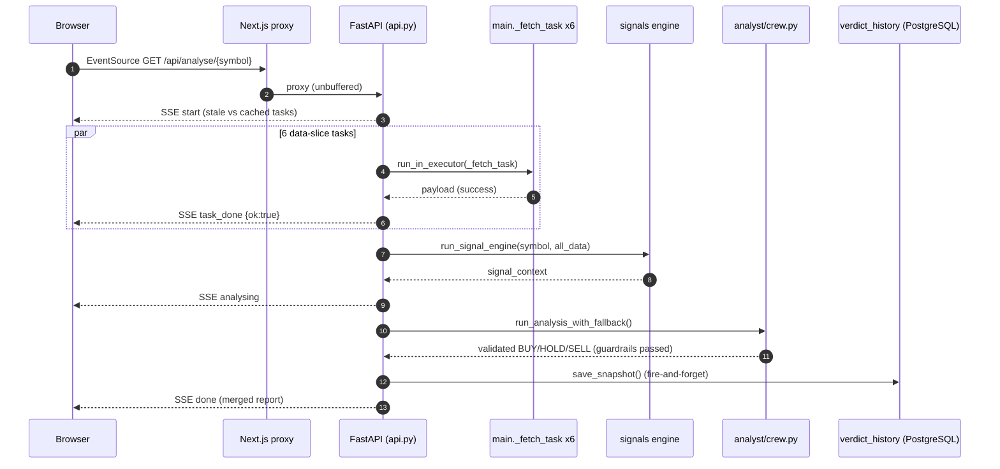
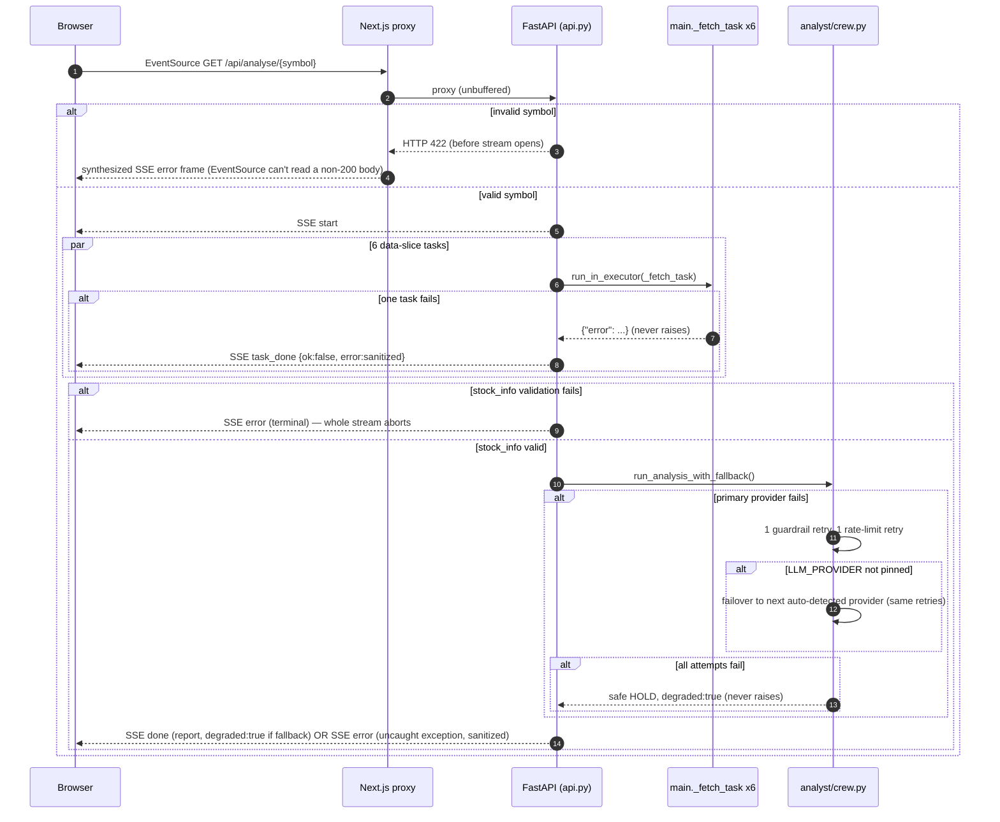

# AlphaPulse Domain Map

Single-repo monolith (`workspace_layout: single-repo`) — one git repository containing two stacks,
both analyzed thoroughly per this engagement's brief: `backend/` (FastAPI, Python) and
`frontend/` (Next.js 15, TypeScript). Evidence throughout this document comes from six parallel
research agents dispatched by this engagement (backend-core, backend-routes/pipelines, frontend,
business-flow tracing, P3b adversarial security, P4 quality/ops), each independently reading
source and cross-checking the repo's own extensive `CLAUDE.md`/`docs/*.md` documentation rather
than trusting it blindly. Where docs and code disagreed, this document says so explicitly (see
§ Mechanical Insights and `UNKNOWNS.md`).

## Inventory

### Repo inventory table

| Repo | Tier | Classification | GitLab squad | Datadog team | Owner confidence | Purpose |
|------|------|----------------|--------------|--------------|------------------|---------|
| stock-research | tier_0 (spans all tiers via its internal modules — see `domain-config.yaml`) | application | N/A (no GitLab) | N/A (Datadog unauthenticated this session) | HIGH (sole operator, `docs/PRD.md` §17.1) | Indian equity research platform: single-stock analysis with LLM verdict, Market Picks multi-agent pipeline, SME/Screener batch signal screeners, Watchlist/Portfolio/Portfolio-Aggregator tracking, magic-link accounts |

### Technology stack

**Backend** (`backend/`): Python, FastAPI `>=0.115,<1.0` + `uvicorn[standard]`; SQLAlchemy Core
`>=2.0,<3.0` (not the ORM — confirmed `Table`/`Column`/`MetaData()` usage, `db/models.py:3-9`) +
`psycopg2-binary` + `alembic>=1.13,<2.0`; `litellm>=1.60,<2.0` for LLM calls; `crewai[anthropic]`
(only its `@tool` decorator survives, per `analyst/crew.py`); `redis>=5.0,<6.0` (optional,
verified genuinely optional — see § Core Domain Deep Dive); `sentry-sdk` (optional);
`cryptography` (Fernet); `casparser`, `openpyxl`, `kiteconnect` for Portfolio Aggregator. No
lockfile (disclosed in the file's own header comment, and independently flagged in
`docs/backlog.md` "Deployment & operations" #8). Evidence: backend-core agent, `requirements.txt`.

**Frontend** (`frontend/`): Next.js 15 (App Router), TypeScript, Tailwind CSS. No unit-test
framework configured (no jest/vitest config found) — Playwright E2E only, every backend response
mocked. Evidence: frontend agent + quality/ops agent.

### Entry points

- **HTTP/SSE**: `backend/api.py` (29 routes directly + 4 `APIRouter` mounts totalling 34 more —
  63 endpoints, see `API_CATALOG.md`). Two SSE streams: `GET /api/analyse/{symbol}`,
  `GET /api/market-picks`.
- **CLI**: `backend/main.py::main()` (`python main.py SYMBOL [--force]`); each of the six batch
  pipelines has its own `main()` CLI wrapper (`sme_ema_pipeline.py`, `screener_pipeline.py`,
  `eod_prices_pipeline.py`, `corporate_actions_pipeline.py`, `market_picks_pipeline.py`,
  `watchlist_alerts.py`).
- **Scheduled jobs**: 5 GitHub Actions cron workflows + 1 weekly live-contract-check — see
  `EVENT_CATALOG.md` § Scheduled triggers (all confirmed by direct file read).
- **Frontend routes**: 9+ App Router pages (`/`, `/compare`, `/market-picks`, `/sme-signals`,
  `/screener`, `/watchlist`, `/portfolio`, `/login`, `/auth/verify`, plus `/api-keys`, `/pricing`,
  `/portfolio-aggregator` not individually re-verified this engagement) — see frontend agent
  report for the confirmed subset.

### External dependencies

- **Database**: PostgreSQL via SQLAlchemy Core, `DATABASE_URL` env var — **optional**; the core
  single-stock analysis flow runs fully without it (file-cache-backed). See § Core Domain Deep
  Dive for the full per-feature degradation table.
- **Cache**: Redis, `REDIS_URL` env var — **optional and genuinely fail-open**, confirmed by
  independent code tracing (quality/ops agent) of every call site's fallback path.
- **Third-party data sources**: NSE (`nseindia.com`, `nsearchives.nseindia.com`), BSE
  (`api.bseindia.com`), Screener.in, yfinance, Trendlyne, AMFI, RBI, Google News (via `gnews`).
- **LLM providers**: Anthropic, OpenAI, Groq, Google Gemini, OpenRouter, Ollama (self-hosted,
  explicit-opt-in only).
- **Broker APIs** (Portfolio Aggregator): Zerodha Kite Connect, HDFC Securities, Paytm Money.
- **SMTP**: generic `smtplib`, gated on `SMTP_HOST`.
- **Sentry** (optional error tracking): gated on `SENTRY_DSN`, genuinely inert when unset.

### Config surface table

Names only, per this engagement's rule — never secret values. Confirmed by direct grep
(backend-core agent, `rg -n "os\.getenv\|os\.environ"` across in-scope backend files) plus
frontend agent confirmation of `API_URL`.

| Key / env var | Repo | Purpose | Prod-only? | Evidence |
|---------------|------|---------|------------|----------|
| `DATABASE_URL` | backend | Postgres DSN — optional, degrades per-feature (see Core Domain Deep Dive) | No | backend-core agent, 12+ call sites grepped |
| `REDIS_URL` | backend | Optional shared cache/rate-limit backing | No | core/cache.py:80, core/rate_limiter.py:55 |
| `PORTFOLIO_ENCRYPTION_KEY` | backend | Fernet key for broker secret/token encryption — hard-fails (never plaintext-falls-back) if unset when needed | No, but required for broker sync | core/crypto.py:24 |
| `LLM_PROVIDER` | backend | Pins the analyst's primary LLM provider (skips auto-fallback-on-stray-key behavior) | No | main.py:289, analyst/crew.py:716,899 |
| `LLM_CONCURRENCY_LIMIT` | backend | Global slot ceiling shared by analysis + market-picks LLM calls (default 4) | No | api.py:53 |
| `EXECUTOR_MAX_WORKERS` | backend | Default thread-pool size | No | api.py:101 |
| `ALLOWED_ORIGINS` | backend | CORS origin allowlist | No | api.py:161 |
| `TRUSTED_PROXY_SECRET` | backend | Gate for trusting `X-Forwarded-For` (per-IP rate-limit correctness) | Recommended in prod | referenced api.py:34 via routes/_shared.py (not independently re-read — MEDIUM) |
| `FRONTEND_URL` | backend | Magic-link email target base URL | No | api.py:2462 |
| `SMTP_HOST`/`SMTP_USER`/`SMTP_PASSWORD`/`SMTP_PORT`/`SMTP_USE_TLS`/`SMTP_FROM` | backend | Email delivery — optional, silent no-op if `SMTP_HOST` unset | No | core/email_sender.py:20,77,82,83,86,102 |
| `SENTRY_DSN`/`SENTRY_ENVIRONMENT` | backend | Optional error tracking | No | core/error_tracking.py:50,64 |
| `ANALYST_MODEL` | backend | Override the analyst's model | No | analyst/crew.py:738 |
| `LOG_LEVEL` | backend | Logging verbosity | No | core/observability.py:19 |
| `API_URL` | frontend | Backend base URL for every proxy route (verified zero hardcoded exceptions repo-wide) | No | 30/30 proxy route files, frontend agent |
| `PORTFOLIO_AGGREGATOR_ENABLED` | frontend | Feature gate for the entire `/api/portfolio/[...path]` catch-all proxy (404s if `"false"`) | No | frontend/app/api/portfolio/[...path]/route.ts:22-27 |
| `NODE_ENV` | frontend | Governs session cookie `Secure` flag (production only) — disclosed risk if a Docker deployment doesn't export it explicitly | Yes (affects security posture) | frontend/lib/auth-cookie.ts:21-24; docs/backlog.md item 8 |

### Repo relationship table

Single repo — no cross-repo relationships. Internal module relationships are captured in
`DEPENDENCY_GRAPH.md` § Service call graph and `BOUNDED_CONTEXTS.md` § Context map.

### Discovery budget checkpoint

See `PROGRESS.md` and `manifest.yaml discovery_budget` — updated at the end of this phase batch.

## Contracts

See `API_CATALOG.md` (63 HTTP endpoints) and `EVENT_CATALOG.md` (2 SSE streams + 6 scheduled
triggers) for the full contract inventory — not duplicated here per this engagement's
cross-linking convention.

### Error code catalog

AlphaPulse does not use a structured error-code enum (no `ErrorCode`/`enum.*Error` pattern found
by any dispatched agent) — errors are FastAPI's standard `{"detail": "..."}` shape with a fixed,
sanitized message set per status code. Key sanitized constants confirmed:

| "Code" (message constant) | HTTP status | Repo | Evidence |
|------|---------|-------------|----------|
| `"An internal error occurred. See server logs."` (`_SANITIZED_ERROR`) | 200 (SSE error frame) | backend/api.py | business-flow agent, api.py:788-793 |
| `"Database error. See server logs."` | 503 | backend/routes/_shared.py | routes/pipelines agent |
| `"DATABASE_URL not configured."` | 503 | backend/routes/_shared.py | routes/pipelines agent |
| `"This sign-in link is invalid, expired, or already used."` | 401 | backend/api.py (auth) | doc-sourced (docs/api-reference.md), MEDIUM |
| `"A refresh is already running."` / `"A fresh market-picks scan is already running."` | 409 | backend/api.py | doc-sourced, MEDIUM |

**Disclosed exception to uniform sanitization**: the Market Picks SSE stream's `analysis_error`
event carries a **truncated raw exception string**, confirmed by the business-flow agent — see
`RISK_MAP.md` and `docs/backlog.md` item 9.

## Mechanical Insights

**Degraded pass — disclosed per `KNOWN_OMISSIONS.md`.** No static-analysis tool
(`understand-anything`, `madge`, `dependency-cruiser`, `pydeps`, `jdeps` is irrelevant — no Java)
was available in this environment. All insights below are from manual `wc -l`/`grep`/direct-read
discovery by the dispatched research agents, not a generated complexity/fan-in graph.

### Top files by size (proxy for complexity — no real cyclomatic-complexity tool available)

1. `backend/api.py` — 2711 lines
2. `backend/pipelines/market_picks_pipeline.py` — 1848 lines
3. `frontend/app/portfolio-aggregator/page.tsx` — 1332 lines
4. `backend/analyst/crew.py` — 925 lines
5. `frontend/types/index.ts` — 900 lines
6. `frontend/components/market-picks-dashboard.tsx` — 840 lines
7. `backend/routes/broker_sync.py` — 812 lines
8. `frontend/app/sme-signals/page.tsx` — 797 lines
9. `frontend/app/market-picks/page.tsx` — 730 lines
10. `backend/tools/nse_tools.py` — 717 lines

Evidence: quality/ops agent (`wc -l` sweep across backend+frontend, excluding node_modules/.next/tests).

### Top endpoints/tables by fan-in (grep-based caller counts, not a generated graph)

- **`resolve_owner()`** (`backend/routes/watchlist.py`) — imported directly by `positions.py` and
  the ownership *pattern* independently replicated in `portfolio_aggregator.py`/`broker_sync.py` —
  the single highest-fan-in helper function found.
- **`transactions`** table — 3 independent writer modules (`cas_import.py`, `csv_import.py`,
  `broker_sync_common.py`) — highest table fan-in among the 23.
- **`positions`** table — 2 writer modules across unrelated features.
- **`verdict_history.save_snapshot()`** — called from 3 distinct call sites (SSE path, CLI,
  watchlist-alerts daily batch).

### Domain flows

See `BUSINESS_FLOWS.md` for all 5 traced journeys.

### 10 essential files (centrality + tag overlap — manual judgment, not a computed score)

`backend/api.py`, `backend/analyst/crew.py`, `backend/main.py`, `backend/auth.py`,
`backend/db/models.py`, `backend/routes/_shared.py`, `backend/core/cache.py`,
`backend/core/rate_limiter.py`, `backend/portfolio/broker_sync_common.py`,
`frontend/lib/useStockAnalysis.ts` — selected as the files every dispatched agent's report cited
most frequently across independent investigations.

### Dependency cycles / dead-code candidates

- **No cyclic dependency found** — manually spot-checked (quality/ops agent):
  `routes/_shared.py ← watchlist.py ← {positions.py, portfolio_aggregator.py} ← broker_sync.py`,
  and `core/` has zero imports from `routes/`/`api.py`. Not exhaustive (no generated graph).
- **Dead-path candidate**: `prices_daily.adj_close` — written but, per this engagement's evidence,
  has zero confirmed production readers (see `RISK_MAP.md`, `UNKNOWNS.md`).

## Per-Repo Deep Dives

### stock-research (single application)

**Ownership card**:
- **Owns**: all 23 Postgres tables (`DATA_OWNERSHIP.md`); all 63 HTTP endpoints; the LLM analyst
  call and its guardrails; 20 external scrapers; 6 batch pipelines; the Next.js BFF proxy layer;
  the magic-link auth system.
- **Does not own**: any external data source's schema (NSE/BSE/Screener.in/etc. are scraped, not
  owned); any payment processing (explicitly out of scope, `docs/PRD.md` §17.3); any brokerage
  execution (`docs/PRD.md` §3 non-goal).

**Auth & Gateway** (per route-prefix, from P3b + backend-core agents):

| Route prefix | Auth mode | Header(s) | Env bypass rule | Salt/secret env var (name only) | Redis OTP usage found? |
|---|---|---|---|---|---|
| `/api/auth/*`, `/api/api-keys*` | session bearer (`Authorization: Bearer`) | `Authorization` | None found | n/a (SHA-256 hash, no HMAC salt) | No — `grep -l 'otp.*redis\|redis.*otp\|OtpService\|OTP_TTL'` returned nothing; HDFC's OTP flow uses the `broker_connections.pending_token_id` column, not Redis |
| `/api/watchlist*`, `/api/positions*` | owner-resolved (session OR `client_id`) | `Authorization`, `client_id` query/body param | None found — invalid/expired token silently falls through to `client_id` (by design, not a bypass) | n/a | No |
| `/api/portfolio/*` (Aggregator + broker sync) | owner-resolved | same | `POST /refresh-valuations` deliberately unscoped (documented, not a bypass) | `PORTFOLIO_ENCRYPTION_KEY` (Fernet key, name only) | No |
| `/api/v1/*` | API key (`X-API-Key`) | `X-API-Key` | None found | n/a (SHA-256 hash) | No |
| Everything else (`/api/analyse`, `/api/market-picks`, `/api/sme-signals`, `/api/screener`, etc.) | none | — | n/a | n/a | No |

Per-repo Redis OTP finding feeds `api_tooling.otp_helper` resolution — this engagement's config
sets `api_tooling.export_mode: never`, so no Postman export is generated regardless.

## Flow

See `BUSINESS_FLOWS.md` for the full 5-journey trace and `EVENT_CATALOG.md` for every SSE event
and cron trigger. Summary critical path (Tier alignment per `domain-config.yaml`):

```text
User submits symbol (frontend/lib/useStockAnalysis.ts)                    [Tier 3 — BFF/gate]
  ↓ EventSource → Next.js proxy → FastAPI
GET /api/analyse/{symbol}  (backend/api.py)                               [Tier 1 — orchestration]
  ↓
Symbol validation (_TICKER_RE) — gate
  ↓
Parallel fetch: 6 data-slice tools (backend/tools/*.py)                   [Tier 1]
  ↓
Signal engine (backend/signals/engine.py)                                 [Tier 1]
  ↓ async transport: none (in-process thread pool, not a queue)
Analyst LLM call + guardrails + cross-provider failover                   [Tier 0 — side-effect executor]
  (backend/analyst/crew.py)
  ↓
Persistence: verdict_history.save_snapshot()                              [Tier 0]
  (backend/analytics/verdict_history.py, PostgreSQL)
  ↓
Downstream: watchlist_alerts.py re-checks daily; Consolidated Search reads [Tier 2 — recon/ops]
  ↓
Terminal state: SSE `done` (success) | `error` (failure) | degraded HOLD (partial failure)
```

### Sequence — happy path (flagship flow: Stock Analysis)



Evidence: `backend/api.py:575-793` (business-flow + backend-core agents, full verified read).
Confidence: HIGH.

### Sequence — failure path (flagship flow: Stock Analysis)



Evidence: `backend/api.py:579-580,619-637,642-645,788-793`; `backend/analyst/crew.py:658-693,745-925`
(business-flow + backend-core agents, full verified read). Confidence: HIGH.

### Sync/async boundary table

| Step | Sync/async | Transport | Timeout owner | Evidence |
|------|------------|-----------|----------------|----------|
| Browser → Next.js proxy | async (EventSource) | HTTP/SSE | Browser's own EventSource timeout (no app-level reconnect logic — confirmed by frontend agent) | frontend/lib/useStockAnalysis.ts:162-173 |
| Next.js proxy → FastAPI | sync passthrough | HTTP, unbuffered | Node's default fetch timeout (not independently verified) | frontend/app/api/analyse/[symbol]/route.ts:29-59 |
| FastAPI → 6 data-slice tools | async bridge → thread pool | in-process | Each `_fetch_task` retries ≤3× internally (main.py:89-157) | api.py:604-637 |
| FastAPI → signal engine | async bridge → thread pool (technical/macro do their own cached I/O) | in-process | Not independently confirmed | api.py:649-656 |
| FastAPI → LLM provider | async bridge → thread pool | HTTPS (via litellm) | Provider-level timeout inside `litellm.completion()`, not independently re-read | api.py:662-760; analyst/crew.py:745-837 |
| FastAPI → PostgreSQL (verdict persist) | async, fire-and-forget | SQL over psycopg2 | None observed — a client disconnect does not cancel this write | api.py:749-753 |
| Cron → pipeline `main()` | async (fire-and-forget, no callback to the trigger) | process spawn (GitHub Actions runner) or HTTP (`market-picks-cron.yml` only) | GitHub Actions job-level timeout (per `docs/backlog.md`'s "Deployment & operations" #3 — `timeout-minutes` now set per job; not independently re-verified this engagement) | .github/workflows/*.yml (business-flow agent opened directly) |

### Code/graph divergence

No mechanical graph exists this engagement (see § Mechanical Insights degradation), so this
category is evidence-thin by construction — classified from manual reading only, per this
engagement's explicit adaptation instructions.

- **MISSING_IN_CODE**: none identified — every manually-traced flow hop in `BUSINESS_FLOWS.md` has
  a corresponding, directly-read source location.
- **DEAD_CODE**: `prices_daily.adj_close`'s write path is live (corporate_actions_pipeline.py) but
  has no confirmed reader — a real candidate, though "dead" here means "unconsumed," not
  "unreachable" (the write path is exercised every cron run). See `RISK_MAP.md`.
- **DYNAMIC_DISPATCH**: `_broker_sync_module(broker)` in `routes/broker_sync.py` dispatches on the
  `broker` path parameter via a plain `if/elif` to one of `kite_sync`/`hdfc_sync`/`paytm_sync` —
  confirmed by the routes/pipelines and P3b agents; the actual implementation taken depends on the
  request, not a static call target.
- **UNKNOWN**: whether `corporate_actions_pipeline.py` has an equivalent health-gate to its
  siblings — flagged in `UNKNOWNS.md`, neither confirmed present nor absent by direct full-file
  reading this engagement.

## Runtime validation (Datadog)

**Skipped.** Datadog MCP is configured but failed to connect (`ENOTFOUND`) in this session; no
KubeSense MCP is configured at all. Per this engagement's explicit degradation instructions, P2b
produced zero runtime-confirmed edges. Every flow/dependency claim in this document is therefore
capped at code-derived confidence (maximum HIGH via static/manual evidence; no claim anywhere in
this engagement's deliverables is marked `runtime_confirmed`). See `KNOWN_OMISSIONS.md` and
`manifest.yaml runtime_validation`.

## Core Domain Deep Dive

### Idempotency

Every write path in this codebase that can plausibly be retried uses an explicit idempotency
mechanism — confirmed independently by three of the six dispatched agents:

- `ON CONFLICT ... DO UPDATE`/`DO NOTHING` upserts: `users`, `verdict_history`,
  `mf_holdings_history`, `sme_stocks`/`ema_signals`, `screener_stocks`, `watchlist_items`,
  `positions`, `valuations`, `securities`, `prices_daily` (except `adj_close`, deliberately
  excluded from the upsert clause to prevent re-ingestion from clobbering an adjusted value).
- Atomic conditional `UPDATE ... RETURNING` for single-use consumption: `magic_links` token
  verification.
- DB-enforced unique constraint: `transactions.uq_transactions_asset_external_ref` (broker-sync
  writer only — the other two `transactions` writers rely on weaker application-level checks, a
  disclosed gap, see `RISK_MAP.md`).
- `pg_advisory_xact_lock` for count-then-insert races: watchlist/positions add (cap enforcement),
  the claim flow (two locks in a fixed order to prevent deadlock), broker-sync per-account locks.
- `state_store.mutate()`'s row-lock pattern (`INSERT ... ON CONFLICT DO UPDATE ... RETURNING` used
  purely to take a lock) for `app_state` read-modify-write — LLM cost accumulation, watchlist-alert
  claim-before-send.

### Routing

Symbol/exchange routing is centralized around `backend/api.py::_TICKER_RE`
(`^[A-Z0-9&\-]{1,20}$`, applied after `.upper().strip()`), with two documented exceptions
(`GET /api/validate/{symbol}` skips it for ISIN/BSE-slug support; `GET /api/prices` silently drops
non-matching entries rather than rejecting). Broker routing (`{broker}` path parameter) dispatches
via a closed allowlist checked before any other logic runs.

### Failure / retry

- **LLM call**: primary provider → 1 guardrail retry + 1 rate-limit retry → failover provider
  (only if `LLM_PROVIDER` wasn't explicitly pinned) → same two retries → safe HOLD fallback,
  `degraded:true`. Never raises to the caller.
- **Scrapers**: "never raise" convention — every tool returns `{"error": ...}` or an all-`None`
  shape on failure; the six-task fetch pipeline retries each task up to 3× internally before
  giving up on that one task alone.
- **Batch pipelines**: per-item failure isolated (logged, counted); whole-run health gate
  (typically >50% error rate) triggers a non-zero exit so GitHub Actions fails the job loudly —
  confirmed for 4 of 6 pipelines directly; `corporate_actions_pipeline.py`'s gate is UNKNOWN (see
  `UNKNOWNS.md`); `market_picks_pipeline.py`'s phase-level exceptions **do** propagate and abort
  the run (a deliberate difference from the per-source/per-stock isolation within each phase).
- **Broker sync**: each broker fetch retries a transient failure (5xx/timeout) up to 3× with
  exponential backoff before surfacing `sync_status: "error"`.

### Concurrency

`ThreadPoolExecutor` is used throughout, never a broker (architectural constraint) — sizes range
from 3-4 (market-picks research/analyze phases) to 8 (SME/screener per-stock fetch, portfolio
concentration's yfinance fan-out). A global LLM concurrency ceiling
(`LLM_CONCURRENCY_LIMIT`, default 4) is shared across the analysis and market-picks flows —
Redis-backed slots with a 600s TTL when available, degrading to an in-memory equivalent otherwise.
**Disclosed gap** (routes/pipelines agent): the batch pipelines (SME/Screener/Market-Picks) do not
call `core/rate_limiter.py`'s concurrency-ceiling primitive at all — only `routes/broker_sync.py`
does, via its per-account locks. If pipeline cron schedules ever overlapped, nothing in this
codebase would prevent simultaneous NSE/yfinance hammering across pipelines (they are staggered by
schedule today, not by a shared concurrency guard).

### PII

- **CAS import**: `cas_import.py::_scrub()` strips PAN/KYC fields and empties `investor_info`
  before archiving to `app_state.cas_archive`; the raw PDF is never persisted; the DB write path
  itself never inserts PAN/KYC fields. Independently confirmed by both the P3b and
  routes/pipelines agents.
- **HDFC login credentials**: `username`/`password` passed straight through to HDFC's own API,
  never written to `broker_connections` or logged (P3b agent).
- **Disclosed gap**: a plaintext email address is logged at `warning` level on SMTP delivery
  failure (`api.py:2501`, `auth_link_email_not_delivered`) — see `RISK_MAP.md` Top Smell #7.
- **`client_id`**: explicitly documented and confirmed as non-secret (appears in plaintext query
  strings) — a disclosed, accepted residual risk, not a PII-handling gap per se.

## Fraud & Compliance

See `RISK_MAP.md` for the ranked findings. Full adversarial control-by-control table, produced by
this engagement's P3b research agent (which was explicitly instructed to attempt to disprove each
control before recording `Exists? YES`):

| Control | Exists? | Evidence | Gaps | Confidence |
|---------|---------|----------|------|------------|
| Replay/duplicate protection | YES | `routes/watchlist.py:222-229`, `routes/positions.py:117-130`, `pipelines/eod_prices_pipeline.py` upserts, `transactions.external_ref` constraint, `cas_import.py` delete-then-replace | None found beyond the already-tracked `csv_import`/`cas_import` no-DB-constraint gap (RISK_MAP.md #5) | HIGH |
| Webhook spoofing / signature verification | N/A — no inbound webhooks exist | `grep -rni "webhook\|callback"` found nothing broker-related; all broker sync is polling/pull-only | N/A | HIGH |
| Encryption at rest (broker secrets) | YES | `core/crypto.py:40-53` Fernet, hard-fails rather than falling back to plaintext; every `broker_connections` write to `api_secret_enc`/`access_token_enc` confirmed to go through `encrypt()` | None found — tried finding a bypass write path and an exception-log leak, neither exists | HIGH |
| Magic-link auth security | YES | 256-bit CSPRNG token, 15-min TTL, single-use atomic consumption, SHA-256-hash-only storage, layered per-IP + per-address rate limits | None found — brute-force and replay both infeasible given entropy + rate limits | HIGH |
| Rate limiting coverage | PARTIAL | Broad coverage confirmed across LLM-calling and pipeline-triggering routes | Opt-in design pattern, not framework-enforced default-deny — a future route could ship unguarded (see RISK_MAP.md #1) | MEDIUM |
| SSRF in scrapers | YES (mitigated) | `_is_trendlyne_host()`/`_is_nse_host()` guard every URL derived from scraped/parsed content before fetching; hardcoded-URL-only scrapers have no host-check but also no attacker-controlled redirect target | None found beyond the already-mitigated cases | HIGH |
| PII handling | PARTIAL | CAS PDF PII scrubbed before archival, never persisted raw | Plaintext email logged at warning level on SMTP failure (Low severity, self-submitted, non-secret) | MEDIUM |
| Privilege escalation / IDOR | YES | `resolve_owner()` + `_owned_*_id()` checks scope every read/write to the caller's own identity; mismatches are 404 (never 403, avoiding id-enumeration) | `client_id` itself is a disclosed, accepted non-secret grouping key (not a bug — documented residual risk with a rate-limited, audited claim-flow mitigation) | HIGH |
| Hardcoded secrets | NO hits | `rg` scan for `password=`/`api_key=`/`secret=` literals returned zero matches | None | HIGH |
| Maker-checker / dual control | N/A, correctly absent | No multi-party approval exists anywhere; correctly so for a single-operator personal tool | None — absence is appropriate here | HIGH |
| Audit trail | PARTIAL | Two `log_event()` calls (`watchlist_claimed`, `positions_claimed`) function as a forensic signal | No formal audit-log table; broker-connection/portfolio changes have no history, only current state — disclosed, accepted gap in `backend/CLAUDE.md` | HIGH |

## Quality & Ops

### Tests

- **Backend**: 78 files under `backend/tests/`, genuinely `unittest`-based (0 files import
  `pytest`) with `pytest` used only as the collector/runner. Strong coverage across
  routes/pipelines/portfolio/analyst/signals (file-by-file inventory in the quality/ops agent's
  report). One gap: `core/observability.py`'s `log_event()` has no dedicated test file.
- **`backend/tests_live/`**: exactly one file, confirmed opt-in via `RUN_LIVE_TESTS=1` env var
  gate, covering the 4 highest-blast-radius scraper contracts (Screener peer table, Trendlyne
  symbol resolution, NSE FII/DII flow, RBI rate table) weekly.
- **Frontend**: 9 Playwright E2E specs, all backend calls mocked via `page.route()` interception —
  confirmed by the frontend agent reading 4 of 9 specs plus the shared `fixtures.ts` directly. **No
  frontend unit-test framework exists** (no jest/vitest config) — every `frontend/lib/*.ts` hook's
  internal logic is exercised only indirectly through mocked E2E specs, a disclosed gap also
  tracked in `docs/backlog.md`.

### Observability

- `core/observability.py::log_event()` — structured JSON per line (`ts`, `event`, arbitrary
  `**fields`); `level="error"` additionally forwards to Sentry when configured.
- **Correlation ID** (`run_id`) is scoped to the two LLM-calling flows only (`/api/analyse`,
  `/api/market-picks`) — no generic request-ID middleware covers every HTTP request. Disclosed gap.
- `core/error_tracking.py` — genuinely opt-in via `SENTRY_DSN`, confirmed inert (early-return) when
  unset.
- `analyst/llm_cost.py` — per-call cost tracked (`provider`, `model`, `run_id`, `cost_usd`,
  tokens), accumulated into a per-UTC-day `app_state.llm_cost` record via the row-locked
  `state_store.mutate()` pattern — safe against concurrent-worker undercounting.

### Correlation IDs

See Observability above — `run_id` only, scoped to two flows.

### Debt

No inline `TODO`/`FIXME`/`HACK`/`XXX` markers exist anywhere in backend or frontend source
(confirmed zero matches by the quality/ops agent's repo-wide grep) — this codebase records debt
exclusively as prose disclosures in `backend/CLAUDE.md`/`docs/backlog.md` rather than code
comments. See `docs/backlog.md` for the full, extensively self-audited debt list (not duplicated
here — it is itself an exceptionally thorough, evidence-cited document this engagement treated as
high-quality secondary evidence throughout).

### Feature toggles

**None exist.** No feature-flag framework, no `FEATURE_*` env var pattern — every optional-infra
behavior (Redis, Sentry, SMTP, DATABASE_URL) is gated by its own single-purpose env var rather
than a generic toggle mechanism. Confirmed by repo-wide grep (quality/ops agent) returning zero
matches for `FeatureFlag|feature\.toggle|toggle\.enabled|FEATURE_`.

### Non-entity Redis/ES usage

- **Redis**: used only for rate limiting (`core/rate_limiter.py`) and cache-sharing
  (`core/cache.py`) — both independently, deliberately duplicate their own lazy-client-construction
  logic (disclosed in `core/cache.py`'s own comment) rather than sharing one module, to avoid
  `cache.py` (imported almost everywhere) taking on a dependency on `rate_limiter.py`. No
  session-store or lock-only Redis usage beyond what's captured in `RUNBOOK.md`'s single-flight
  lock section.
- **Elasticsearch**: not used anywhere in this codebase — no matches for
  `ElasticsearchTemplate|@Document\(indexName` (consistent with the architectural constraints
  table's PostgreSQL-only datastore rule).
