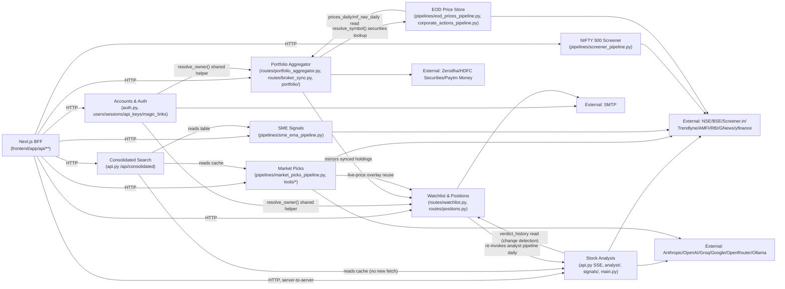

# Bounded Contexts

AlphaPulse is a single deployable monolith (one FastAPI process + one Next.js process), so
"context" boundaries here are **module/package boundaries within one repo**, not separate
services. Detected from `backend/`'s top-level package structure, `frontend/app/` route groups,
and the 23-table schema's ownership lines (`DATA_OWNERSHIP.md`) — corroborated by all six of this
engagement's parallel research agents.

## Context map

**View: logical context** · **Confidence: HIGH** (every edge below is independently confirmed by
at least one of the six research agents dispatched in this engagement, cited per context card).

## Context cards

### Stock Analysis

| Field | Content |
|---|---|
| Context name | Stock Analysis |
| Owner | Sole operator (no squad structure — `SQUAD_MAP.md`) |
| Repositories | `backend/api.py` (SSE handler), `backend/main.py`, `backend/analyst/`, `backend/signals/`, `backend/core/schemas.py`, `backend/core/cache.py`, `backend/analytics/verdict_history.py`, `backend/analytics/mf_holdings_history.py` |
| Primary entities | Analysis report (file cache, not a table); `verdict_history` row (authoritative: `analytics/verdict_history.py`) |
| Public APIs | `GET /api/analyse/{symbol}` (SSE), `GET /api/validate/{symbol}`, `GET /api/verdict-history/{symbol}`, plus 5 standalone enrichment endpoints (`/api/peers`, `/api/financials`, `/api/shareholding-detail`, `/api/insider-activity`, `/api/street-consensus`) — see `API_CATALOG.md` #3-4,10-15 |
| Events published | SSE `start`/`task_done`/`analysing`/`done`/`error` — see `EVENT_CATALOG.md` |
| Events consumed | none |
| Data ownership | `verdict_history`, `mf_holdings_history` — see `DATA_OWNERSHIP.md` |
| Upstream contexts | Watchlist & Positions (re-invokes this context's own pipeline daily per-symbol); Consolidated Search (reads this context's `analysis` cache, never triggers it) |
| Downstream contexts | External scrapers (NSE/BSE/Screener.in/yfinance/Trendlyne/RBI/GNews), LLM providers |
| Confidence | HIGH — independently traced end-to-end by the business-flow agent (Journey 1) and the backend-core agent (analyst/crew.py, verdict_history.py) |

### Market Picks

| Field | Content |
|---|---|
| Context name | Market Picks |
| Owner | Sole operator |
| Repositories | `backend/pipelines/market_picks_pipeline.py`, `backend/tools/market_picks_tools.py` (+5 satellite scraper modules merged into it), `backend/telemetry/source_quality.py`, `backend/telemetry/source_health.py` |
| Primary entities | `MarketPick` (file cache `output/_market_picks/picks.json`); `app_state.market_picks_history` daily snapshots |
| Public APIs | `GET /api/market-picks` (SSE), `/status`, `/history` — API_CATALOG.md #5-7 |
| Events published | 12-event SSE stream — `EVENT_CATALOG.md` |
| Events consumed | none |
| Data ownership | File cache + `app_state` namespaces only — no dedicated Postgres table of its own |
| Upstream contexts | none (a top-level flow) |
| Downstream contexts | Watchlist & Positions (its `positions` table is what "I bought this" from a pick writes to — reusing `resolve_owner()`); Consolidated Search reads its cache |
| Confidence | HIGH — business-flow agent (Journey 2) + routes/pipelines agent both independently traced this |

### SME Signals

| Field | Content |
|---|---|
| Context name | SME Signals |
| Owner | Sole operator |
| Repositories | `backend/pipelines/sme_ema_pipeline.py`, `backend/tools/sme_tools.py` |
| Primary entities | `sme_stocks`, `ema_signals` (authoritative: `pipelines/sme_ema_pipeline.py`) |
| Public APIs | `GET /api/sme-signals`, `/{symbol}/history`, `POST /refresh` — API_CATALOG.md #16-18 |
| Events published | none (no SSE — plain JSON reads over an already-populated table) |
| Events consumed | cron trigger — `EVENT_CATALOG.md` |
| Data ownership | `sme_stocks`, `ema_signals` |
| Upstream contexts | none |
| Downstream contexts | Consolidated Search (reads latest regime row) |
| Confidence | HIGH — business-flow agent (Journey 5) traced `run()` directly |

### NIFTY 500 Screener

| Field | Content |
|---|---|
| Context name | NIFTY 500 Screener |
| Owner | Sole operator |
| Repositories | `backend/pipelines/screener_pipeline.py`, `backend/tools/nifty500_tools.py` |
| Primary entities | `screener_stocks` |
| Public APIs | `GET /api/screener`, `POST /refresh` — API_CATALOG.md #19-20 |
| Events published | none |
| Events consumed | cron trigger |
| Data ownership | `screener_stocks` |
| Upstream contexts | none |
| Downstream contexts | none observed |
| Confidence | HIGH — business-flow agent (Journey 5) |

### Watchlist & Positions

| Field | Content |
|---|---|
| Context name | Watchlist & Positions (cross-mode user data) |
| Owner | Sole operator |
| Repositories | `backend/routes/watchlist.py`, `backend/routes/positions.py`, `backend/routes/_shared.py`, `backend/pipelines/watchlist_alerts.py`, `backend/portfolio/positions_mirror.py` |
| Primary entities | `watchlist_items`, `positions` — dual ownership (`client_id` XOR `user_id`), enforced by a CHECK + two UNIQUE constraints (`DATA_OWNERSHIP.md`) |
| Public APIs | `GET/POST/DELETE /api/watchlist*`, `GET/POST/PATCH/DELETE /api/positions*`, `GET /api/portfolio/concentration` — API_CATALOG.md #30-40 |
| Events published | none (no SSE); daily cron triggers `watchlist_alerts.py` (an email, not an in-app event) |
| Events consumed | cron trigger (`watchlist-alerts-cron.yml`) |
| Data ownership | `watchlist_items`, `positions` (also written by `portfolio/positions_mirror.py` on broker sync — see `RISK_MAP.md` "Multiple writers") |
| Upstream contexts | Portfolio Aggregator (broker-sync mirrors into `positions`); Market Picks (its own "I bought this" action writes here) |
| Downstream contexts | Stock Analysis (re-invokes its pipeline daily per-symbol); Accounts & Auth (`resolve_owner()` shared helper); SMTP (alert emails) |
| Confidence | HIGH — P3b security agent read `routes/watchlist.py`/`routes/positions.py` directly; routes/pipelines agent confirmed the `positions_mirror.py` cross-write |

### Portfolio Aggregator

| Field | Content |
|---|---|
| Context name | Portfolio Aggregator (personal net-worth tracker) |
| Owner | Sole operator |
| Repositories | `backend/routes/portfolio_aggregator.py`, `backend/routes/broker_sync.py`, `backend/portfolio/` (valuation, cas_import, csv_import, dcf_valuation, broker_sync_common, kite_sync, hdfc_sync, paytm_sync) |
| Primary entities | `profiles → accounts → assets → {holdings, valuations, transactions}`, `broker_connections` |
| Public APIs | 23 endpoints under `/api/portfolio/*` — API_CATALOG.md #41-63 |
| Events published | none |
| Events consumed | cron (its nightly valuation step is chained inside the EOD pipeline's cron, not its own) |
| Data ownership | `profiles`, `accounts`, `assets`, `holdings`, `valuations`, `transactions`, `broker_connections` — see `DATA_OWNERSHIP.md` for the 3-4-writer detail on `assets`/`transactions` |
| Upstream contexts | none |
| Downstream contexts | EOD Price Store (`prices_daily`/`mf_nav_daily` reads for valuation, `securities` for symbol resolution); Watchlist & Positions (mirrors synced holdings into `positions`); External brokers (Zerodha/HDFC/Paytm) |
| Confidence | HIGH — routes/pipelines agent + P3b agent both read `routes/broker_sync.py`, `portfolio/*.py` directly; business-flow agent traced Journey 4 |

### Accounts & Auth

| Field | Content |
|---|---|
| Context name | Accounts & Auth |
| Owner | Sole operator |
| Repositories | `backend/auth.py`, auth-related routes in `backend/api.py` |
| Primary entities | `users`, `magic_links`, `sessions`, `api_keys` |
| Public APIs | `/api/auth/*`, `/api/api-keys*`, `/api/v1/consolidated/{symbol}` (API-key-gated) — API_CATALOG.md #22-29 |
| Events published | none |
| Events consumed | none |
| Data ownership | `users`, `magic_links`, `sessions`, `api_keys` |
| Upstream contexts | Every owner-scoped context calls `resolve_owner()`, which this context's session-token validation feeds |
| Downstream contexts | SMTP (magic-link email) |
| Confidence | HIGH — backend-core agent read `auth.py` in full; P3b agent independently confirmed token security properties |

### EOD Price Store (ingestion-only, no request-serving endpoint)

| Field | Content |
|---|---|
| Context name | EOD Price Store + Corporate Actions |
| Owner | Sole operator |
| Repositories | `backend/pipelines/eod_prices_pipeline.py`, `backend/pipelines/corporate_actions_pipeline.py`, `backend/tools/eod_sources.py`, `backend/tools/corporate_actions.py`, `backend/tools/securities_master.py` |
| Primary entities | `securities`, `prices_daily`, `mf_nav_daily`, `corporate_actions` |
| Public APIs | none of its own — ingestion-only |
| Events published | none |
| Events consumed | cron trigger (chains corporate-actions + portfolio-valuation as internal isolated steps) |
| Data ownership | `securities`, `prices_daily` (except `adj_close`, owned by Corporate Actions sub-context), `mf_nav_daily`, `corporate_actions` |
| Upstream contexts | none |
| Downstream contexts | Portfolio Aggregator (valuation engine reads `prices_daily`/`mf_nav_daily`; `csv_import` reads `securities` via `resolve_symbol()`) |
| Confidence | HIGH — business-flow agent traced Journey 4's chain into this context directly |

### Consolidated Search (edge aggregation, not a core domain)

| Field | Content |
|---|---|
| Context name | Consolidated Search |
| Owner | Sole operator |
| Repositories | `backend/api.py` (`_consolidated_payload()`), `frontend/components/header-search.tsx`, `consolidated-card.tsx` |
| Primary entities | none of its own — pure read-aggregation |
| Public APIs | `GET /api/consolidated/{symbol}`, `GET /api/v1/consolidated/{symbol}` — API_CATALOG.md #21,29 |
| Events published | none |
| Events consumed | none |
| Data ownership | none — reads Stock Analysis's `analysis` cache, Market Picks' cache, SME's latest regime row |
| Upstream contexts | none |
| Downstream contexts | Stock Analysis, Market Picks, SME Signals (read-only, never triggers fetching) |
| Confidence | HIGH — frontend agent confirmed null-section handling in `consolidated-card.tsx`; doc-corroborated for the backend aggregation logic (`_consolidated_payload`) |

### Next.js BFF (edge, not a core domain)

| Field | Content |
|---|---|
| Context name | Next.js BFF / proxy layer |
| Owner | Sole operator |
| Repositories | `frontend/app/api/**` (33 route files, confirmed by frontend agent), `frontend/lib/auth-cookie.ts`, `frontend/lib/proxy-headers.ts` |
| Primary entities | none — stateless passthrough except the session cookie |
| Public APIs | Every `frontend/app/api/*` route mirrors a backend path 1:1 (confirmed no orphaned/missing contract by the quality/ops agent) |
| Events published | SSE passthrough (not a new event, forwards backend's own) |
| Events consumed | none |
| Data ownership | none (httpOnly session cookie only, not a data store) |
| Upstream contexts | Every backend context |
| Downstream contexts | Browser |
| Confidence | HIGH — frontend agent read all 30+ proxy route files directly |

## Detection heuristics applied

- **BFF is thin, marked edge not core domain**: confirmed — every proxy route is a direct 1:1
  passthrough plus auth-header/IP-header translation (frontend agent, §2), no business logic found
  in the proxy layer.
- **Shared library ≠ shared context**: `backend/routes/_shared.py`, `backend/routes/watchlist.py`'s
  `resolve_owner()`/`owner_column()` (imported by `positions.py`, and the ownership *pattern*
  replicated independently in `portfolio_aggregator.py`) are dependency nodes, not their own
  bounded context — they implement a cross-cutting *ownership resolution* capability shared by three
  contexts, not a fourth context of their own.
- **Separate deployable per context**: does not apply — single monolith by architectural
  constraint; contexts here are module boundaries.
