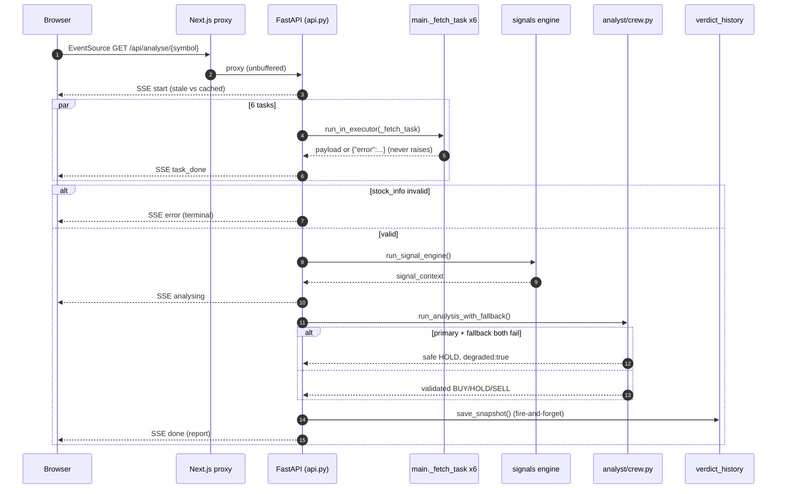
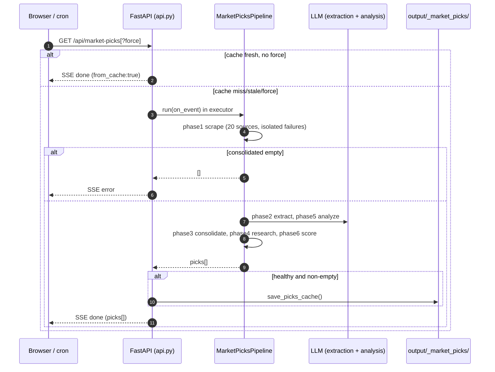

# Business Flows

Five journeys traced hop-by-hop against actual source by this engagement's business-flow tracing
agent (21 files read directly, ~25 grep/search invocations), cross-checked against
`docs/architecture.md`/`backend/CLAUDE.md` prose (agreement found on every claim checked; no
contradiction surfaced). All evidence below is `backend/<path>:<line>` unless marked doc-sourced.

## Journey index

| # | Journey | Trigger | Terminal | Confidence |
|---|---------|---------|----------|------------|
| 1 | Stock Analysis (SSE) | Browser submits/deep-links a symbol | `done` (report) or `error` | HIGH |
| 2 | Market Picks pipeline | Cache miss/expiry or `?force=true`, or weekly cron | `done` (picks[]) or `error` | HIGH |
| 3 | Watchlist alert email | Daily cron (13:30 UTC weekdays) | Digest email sent, or run fails loudly (health gate) | HIGH |
| 4 | Portfolio Aggregator nightly valuation | Daily cron (14:15 UTC weekdays), chained after EOD price ingestion | `valuations` rows upserted for every priceable asset | HIGH |
| 5 | SME / Screener batch signal pipelines | Daily cron (13:00/14:00 UTC weekdays) | `sme_stocks`/`ema_signals` or `screener_stocks` upserted, or run fails loudly | HIGH |

---

### Journey 1 — Stock Analysis (SSE)

| Field | Value |
|-------|-------|
| Trigger | Browser opens `EventSource('/api/analyse/{symbol}?force=...')` — `frontend/lib/useStockAnalysis.ts:133` |
| Entry service | `backend/api.py:575-576` `GET /api/analyse/{symbol}` |
| Terminal condition | `done` (report merged, verdict persisted) or `error` (invalid symbol / stock_info validation failure / uncaught exception) |
| Overall confidence | HIGH |

#### Services (ordered)

| Step | Service | Sync/async | Exercise | Evidence |
|------|---------|------------|----------|----------|
| 1 | frontend/lib/useStockAnalysis.ts | sync (browser) | referenced | useStockAnalysis.ts:133 |
| 2 | frontend/app/api/analyse/[symbol]/route.ts (Next.js proxy) | sync HTTP passthrough, unbuffered | referenced | route.ts:29-59; synthesizes its own 200 SSE `error` frame on upstream failure (route.ts:5-15,43-52) since `EventSource` silently drops non-200 responses |
| 3 | backend/api.py (SSE handler) | async | referenced | api.py:575-580 — `_TICKER_RE` validation, 422 before stream opens if invalid |
| 4 | backend/api.py cache-freshness check | sync | referenced | api.py:596-600 — emits `start` |
| 5 | backend/main.py::_fetch_task ×6 (parallel) | async bridge → `run_in_executor` thread pool | referenced | api.py:604-637; main.py:76-159 (retries ≤3×, never raises) |
| 6 | backend/core/schemas.py::schema_validate("stock_info") | sync | referenced | api.py:642-645 — the **only** one of the six tasks whose failure aborts the whole stream |
| 7 | backend/signals/engine.py::run_signal_engine | async (executor-offloaded — does its own cached I/O) | referenced | api.py:649-656 |
| 8 | backend/analyst/crew.py::run_analysis_with_fallback | async (background task in executor) | referenced | api.py:662-760; crew.py:840-925 |
| 9 | backend/analytics/verdict_history.py::save_snapshot | async, fire-and-forget | referenced | api.py:749-753; verdict_history.py:33-109 |
| 10 | backend/main.py::_build_report → `done` SSE event | sync | referenced | api.py:783-786 |

#### Events

| Event | Producer | Consumers | Exercise | Evidence |
|-------|----------|-----------|----------|----------|
| `start`, `task_done`×6, `analysing`, `done`, `error`, `: heartbeat` | backend/api.py | frontend/lib/useStockAnalysis.ts | referenced | see `EVENT_CATALOG.md` |

#### State changes

| Entity | From → To | Authority | Evidence |
|--------|-----------|-----------|----------|
| `verdict_history` row `(symbol, today)` | absent → `{BUY,HOLD,SELL}` (or overwritten same-day, last-write-wins) | backend/analytics/verdict_history.py:33-109 (`ON CONFLICT DO UPDATE`, `signal_score` COALESCEd) | HIGH |
| Analysis report `degraded` flag | `false` (real LLM call validated) → `true` (safe HOLD fallback, both providers failed) | backend/analyst/crew.py:658-693,925 | HIGH |

#### Failure points

| Step | Failure mode | Handler | Evidence |
|------|--------------|---------|----------|
| 3 | Invalid symbol | `422` before stream opens (real HTTP status, not an SSE frame) | api.py:579-580 |
| 5 | One of six data-slice fetches fails | Isolated `task_done{ok:false}` for that task only; other five continue via `asyncio.gather` | api.py:619-637 |
| 6 | `stock_info` task itself fails/malformed | Whole stream emits terminal `error`; the other five tasks' partial results are discarded | api.py:642-645 |
| 8 | Primary LLM provider fails | One guardrail retry, one rate-limit retry, then failover to the first other *auto-detected* configured provider (only if `LLM_PROVIDER` env var was never explicitly pinned) | analyst/crew.py:745-925 |
| 8 | Both providers fail (or only one configured and it fails) | `_safe_analysis_fallback()` — hardcoded HOLD/LOW-confidence, `_degraded:true`, never a raised exception to the caller | analyst/crew.py:658-693 |
| 8 (outer) | Uncaught exception in the whole background analyst task | A second, independent safety net substitutes an equivalent hardcoded degraded-HOLD dict | api.py:692-737 |
| any | Uncaught exception anywhere in `stream()` | Caught at the outermost level, emits sanitized `error` event (`_SANITIZED_ERROR` constant — never raw exception text, except the disclosed Market Picks `analysis_error.reason` exception in Journey 2) | api.py:788-793 |

---

### Journey 2 — Market Picks pipeline

| Field | Value |
|-------|-------|
| Trigger | Browser `GET /api/market-picks` (cache miss/stale, or `?force=true`) — also `market-picks-cron.yml` calling `?force=true` weekly on the live backend |
| Entry service | `backend/api.py:802-803` |
| Terminal condition | `done` (picks[], cached only if non-empty AND `pipeline.healthy`) or `error` |
| Overall confidence | HIGH |

#### Services (ordered)

| Step | Service | Sync/async | Exercise | Evidence |
|------|---------|------------|----------|----------|
| 1 | backend/api.py — cache-hit short-circuit | sync | referenced | api.py:828-839 |
| 2 | backend/api.py — single-flight lock (`force` path: rate-limited 3/hr; cold-cache path: locked to prevent thundering herd) | sync | referenced | api.py:814,819,850-857 |
| 3 | backend/pipelines/market_picks_pipeline.py::run() phase 1 — scrape 20 sources | async bridge, `ThreadPoolExecutor(max_workers=6)` | referenced | market_picks_pipeline.py:961-991 |
| 4 | phase 2 — LLM extraction | thread pool | referenced | market_picks_pipeline.py:1001+ |
| 5 | phase 3 — consolidate + validate vs. NSE equity master | sync within thread | referenced | market_picks_pipeline.py:1228 |
| 6 | **health gate** — abort if `consolidated` empty | sync | referenced | market_picks_pipeline.py:920-942 |
| 7 | phase 4 — research (signal engine + peer valuation anchor per candidate) | thread pool | referenced | market_picks_pipeline.py:1427 |
| 8 | phase 5 — batched LLM qualitative analysis | thread pool | referenced | market_picks_pipeline.py:1557 |
| 9 | phase 6 — deterministic scoring + sector balancing + daily snapshot write | sync within thread | referenced | market_picks_pipeline.py:1663 |
| 10 | backend/api.py — cache gate + terminal `done` | sync | referenced | api.py:899-912 |

#### Events

See `EVENT_CATALOG.md` § Market Picks stream — 12 distinct SSE event types across 6 phases.

#### State changes

| Entity | From → To | Authority | Evidence |
|--------|-----------|-----------|----------|
| Market-picks file cache (`output/_market_picks/picks.json`) | absent/stale → fresh (only on a non-empty, healthy run) | api.py:899-905 | HIGH |
| `app_state.market_picks_history[date]` | absent → one day's snapshot | pipelines/market_picks_pipeline.py (doc-sourced, phase 6) | MEDIUM |

#### Failure points

| Step | Failure mode | Handler | Evidence |
|------|--------------|---------|----------|
| 3 | One of 20 sources fails | Isolated per-source `{"articles":[], "error":...}`; run continues | market_picks_pipeline.py:971-975 |
| 6 | >70% of sources return zero articles, or zero picks survive consolidation | `self.healthy=False` (logged, run continues) for the first condition; **early abort** returning `[]` + terminal `error` for the second | market_picks_pipeline.py:920-942 |
| 7-9 | Uncaught exception inside any phase | `_timed_phase()` logs then **re-raises** — aborts the whole run, propagates to `api.py`'s outer except → sanitized `error` SSE event | market_picks_pipeline.py:894-911; api.py:913-915 |
| 8 | A batched LLM analysis call fails for one batch | `analysis_error` SSE event carries a **truncated raw exception string** — the one disclosed exception to this app's otherwise-uniform error sanitization (`docs/backlog.md` item 9, unfixed) | docs/api-reference.md:363-365 |

---

### Journey 3 — Watchlist alert email (daily batch)

| Field | Value |
|-------|-------|
| Trigger | `.github/workflows/watchlist-alerts-cron.yml:9` — `30 13 * * 1-5` (19:00 IST weekdays) |
| Entry service | `backend/pipelines/watchlist_alerts.py::main()` |
| Terminal condition | Digest email(s) sent per affected account, or `run()` returns `False` (>50% per-symbol failure rate) → `SystemExit(1)` |
| Overall confidence | HIGH |

#### Services (ordered)

| Step | Service | Sync/async | Exercise | Evidence |
|------|---------|------------|----------|----------|
| 1 | `_get_watched_symbols()` — `JOIN users WHERE user_id IS NOT NULL` | sync SQL | referenced | pipelines/watchlist_alerts.py:118-135 — anonymous `client_id` rows structurally excluded by the JOIN, confirmed in code, not just documented |
| 2 | Cap at 50 symbols (`_MAX_ALERT_SYMBOLS`) | sync | referenced | watchlist_alerts.py:103,256-261 |
| 3 | `_analyze_symbol()` per symbol (reuses cache TTLs — no double-bill) — same signal-engine + analyst path as Journey 1 | thread pool (`max_workers=len(stale_tasks)`, ≤6) | referenced | watchlist_alerts.py:138-191,155 |
| 4 | `verdict_history.save_snapshot()` on every path including cache-hit | sync per symbol | referenced | watchlist_alerts.py:176,187 |
| 5 | `verdict_history.detect_recent_changes()` — recommendation-change + ≥10% price-move detection | sync | referenced | analytics/verdict_history.py:154-187 |
| 6 | `_claim_alert_keys()` — atomic claim-before-send via `state_store.mutate()` | sync, DB row-locked | referenced | watchlist_alerts.py:49-82 |
| 7 | `send_watchlist_alert_email()` — one digest per user per run, not one per symbol | sync (SMTP) | referenced | core/email_sender.py:136; watchlist_alerts.py:305-309 |
| 8 | `_release_alert_keys()` on SMTP failure | sync | referenced | watchlist_alerts.py:319 |

#### Events

No SSE — pure batch job. Cron trigger is the async boundary (see `EVENT_CATALOG.md`).

#### State changes

| Entity | From → To | Authority | Evidence |
|--------|-----------|-----------|----------|
| `verdict_history` row (symbol, today) | absent → verdict (same mechanism as Journey 1) | analytics/verdict_history.py:33-109 | HIGH |
| Alert claim key `(user, symbol, kind, date)` | unclaimed → claimed → sent (or released back to unclaimed on SMTP failure) | watchlist_alerts.py:49-82,319 | HIGH |

#### Failure points

| Step | Failure mode | Handler | Evidence |
|------|--------------|---------|----------|
| 3 | One symbol's analysis raises | Caught, logs `watchlist_alert_symbol_failed`, returns `None`; loop continues past it | watchlist_alerts.py:145-191,189-191 |
| 7 | SMTP send fails | Claimed keys released (`_release_alert_keys`) so a transient failure doesn't permanently masquerade as "already sent" | watchlist_alerts.py:319 |
| overall | >50% of symbols failed to analyze | `run()` returns `False` → `main()` raises `SystemExit(1)` → GitHub Actions job fails loudly | watchlist_alerts.py:328-333,344-345 |

---

### Journey 4 — Portfolio Aggregator nightly valuation

| Field | Value |
|-------|-------|
| Trigger | `.github/workflows/eod-prices-cron.yml:9` — `15 14 * * 1-5` (19:45 IST weekdays); also on-demand `POST /api/portfolio/refresh-valuations` (globally unscoped, see API_CATALOG.md #53) |
| Entry service | `backend/pipelines/eod_prices_pipeline.py::run()` (valuation is its 4th, isolated step) |
| Terminal condition | `valuations` upserted for every priceable non-archived `mf`/`stock` asset; a per-asset price miss is skipped (prior value stands) |
| Overall confidence | HIGH |

#### Services (ordered)

| Step | Service | Sync/async | Exercise | Evidence |
|------|---------|------------|----------|----------|
| 1 | `eod_prices_pipeline.run()` — bhavcopy + NAV ingestion (steps 1-2) | sync | referenced | eod_prices_pipeline.py:262-294 |
| 2 | corporate-actions ingestion + `adj_close` recompute (step 3, isolated try/except) | sync | referenced | eod_prices_pipeline.py:284 |
| 3 | `portfolio.portfolio_valuation.refresh_valuations(engine)` (step 4, isolated try/except so a failure here never flips the pipeline's own exit code) | sync | referenced | eod_prices_pipeline.py:288-292 |
| 4 | `refresh_valuations()` queries `assets JOIN holdings` for every non-archived mf/stock asset | sync SQL | referenced | portfolio_valuation.py:154-208,162-167 |
| 5 | Price resolution: stock → `prices_daily.close` (raw, not `adj_close`) with a live yfinance fallback; MF → `mf_nav_daily.nav` | sync | referenced | portfolio_valuation.py:99-131 |
| 6 | `upsert_valuation()` — `ON CONFLICT (asset_id, as_of) DO UPDATE` | sync SQL | referenced | portfolio_valuation.py:136-151 |
| 7 (on demand) | `xirr_report()` — Newton's-method-with-bisection XIRR per asset + pooled | sync | referenced | portfolio_valuation.py:213+ |

#### Events

None — chained batch step, no SSE.

#### State changes

| Entity | From → To | Authority | Evidence |
|--------|-----------|-----------|----------|
| `valuations` row (asset, today) | absent/stale → fresh `value = units × price` | portfolio_valuation.py:136-151,197-198 | HIGH |

#### Failure points

| Step | Failure mode | Handler | Evidence |
|------|--------------|---------|----------|
| 3 | Valuation step itself raises | Isolated try/except — never affects the equity-ingestion pipeline's own exit code | eod_prices_pipeline.py:291-292 |
| 5 | A single asset has no resolvable price | Skipped, logged (`valuation_skipped`); prior valuation left untouched — never zeroed or guessed | portfolio_valuation.py:190-193,206 |

---

### Journey 5 — SME / Screener batch signal pipelines

| Field | Value |
|-------|-------|
| Trigger | `.github/workflows/sme-cron.yml` (`0 13 * * 1-5`) and `.github/workflows/screener-cron.yml` (`0 14 * * 1-5`); also `POST /api/sme-signals/refresh` / `POST /api/screener/refresh` on demand |
| Entry service | `backend/pipelines/sme_ema_pipeline.py::run()` / `backend/pipelines/screener_pipeline.py::run()` |
| Terminal condition | Postgres upserted, or `run()` returns `False` (health gate) → non-zero exit |
| Overall confidence | HIGH |

#### Services (ordered) — SME

| Step | Service | Sync/async | Exercise | Evidence |
|------|---------|------------|----------|----------|
| 1 | `get_all_sme_stocks()` — NSE Emerge + BSE SME lists | sync | referenced | sme_ema_pipeline.py:449-461 (abort if empty) |
| 2 | Parallel OHLCV download | `ThreadPoolExecutor(max_workers=8)` | referenced | sme_ema_pipeline.py:470-482 |
| 3 | EMA20/50 golden/death-cross + RSI + volume-spike + liquidity computation | sync per stock | referenced | sme_ema_pipeline.py:129-146 (cross logic), 490-496 |
| 4 | `_upsert_signals`/`_upsert_liquidity`/`_upsert_market_cap` (`ON CONFLICT ... DO UPDATE`) | sync SQL | referenced | sme_ema_pipeline.py:501-504 |
| 5 | Health gate: error rate > 50% → `run()` returns `False` | sync | referenced | sme_ema_pipeline.py:509-517 |

#### Services (ordered) — Screener

| Step | Service | Sync/async | Exercise | Evidence |
|------|---------|------------|----------|----------|
| 1 | `get_nifty500_constituents()` | sync | referenced | screener_pipeline.py:159-162 (abort if empty) |
| 2 | `_fetch_one()` per stock — quote + technical signal, independently try/excepted | `ThreadPoolExecutor(max_workers=8)` | referenced | screener_pipeline.py:51-98,71-82 |
| 3 | `_upsert_stocks()` (`ON CONFLICT (symbol) DO UPDATE`) | sync SQL | referenced | screener_pipeline.py:101-135 |
| 4 | Health gate: error rate > 50% | sync | referenced | screener_pipeline.py:187-195 |

#### Read path (both)

`GET /api/sme-signals` (`api.py:1853+`, view=crosses\|regime) and `GET /api/screener`
(`api.py:2174+`, whitelisted `sort` column) serve the upserted tables; frontend consumes via
`frontend/app/sme-signals/page.tsx` and `frontend/app/screener/page.tsx`. `POST .../refresh`
endpoints run the pipeline in a background executor, `202`.

#### Failure points

| Step | Failure mode | Handler | Evidence |
|------|--------------|---------|----------|
| SME step 2 / Screener step 2 | Per-stock fetch fails | Isolated, logged, counted toward error rate | sme_ema_pipeline.py:61-87; screener_pipeline.py:71-82 |
| both | >50% error rate | `run()` returns `False`; `main()` exits non-zero, GH Actions job fails loudly | sme_ema_pipeline.py:509-517; screener_pipeline.py:187-195 |

---

## Cross-flow notes

- Every batch pipeline shares the same shape: `run()` returns a bool health signal, `main()` exits
  non-zero on `False` — a deliberate, repeated pattern per `docs/architecture.md`'s "Batch
  pipelines & scheduling" table, independently confirmed in 5 of 6 pipelines by the business-flow
  and routes/pipelines research agents. `corporate_actions_pipeline.py` was **not** confirmed to
  have an equivalent `>50%`-style health gate in this engagement's source reading — see
  `RISK_MAP.md` and `UNKNOWNS.md`.
- Journeys 1 and 3 share the identical core analyst call path
  (`main._fetch_task` → `run_signal_engine` → `run_analysis_with_fallback` →
  `verdict_history.save_snapshot`) — Journey 3 is not a separate implementation, it is a scheduled
  re-invocation of Journey 1's own pipeline per watched symbol.
