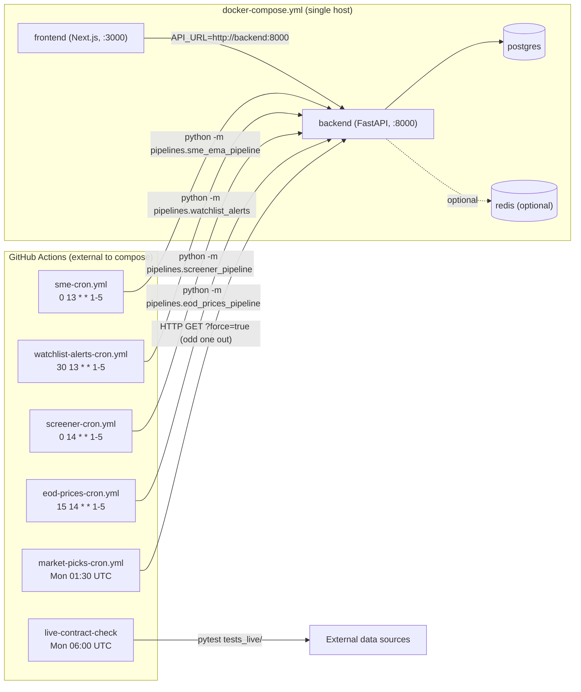

# Dependency Graph

Four views — do not merge edge types. **P0.5 mechanical pass note**: no static-analysis tool
(`understand-anything`, `madge`, `dependency-cruiser`, `pydeps`) was available in this environment
(confirmed absent by direct filesystem search — see `KNOWN_OMISSIONS.md`). All views below are
built from manual/grep-based discovery by this engagement's dispatched research agents (backend
core, backend routes/pipelines, frontend, quality/ops), not a generated call graph. Confidence is
capped accordingly per view.

## Logical context graph

See `BOUNDED_CONTEXTS.md` § Context map for the full bounded-context diagram (cross-linked, not
duplicated here per `required-diagrams.md`'s "cross-link when the same entity appears in multiple
views" rule).

**View: logical context** · **Confidence: HIGH**

## Service call graph

Module-to-module `calls`/`imports` edges within the monolith, from direct source reading (no
generated graph — see note above). Cycles checked manually by the quality/ops agent: confirmed
**no cyclic dependency** across `routes/_shared.py ← {watchlist.py} ← {positions.py,
portfolio_aggregator.py} ← broker_sync.py`, and `core/` has zero imports from `routes/`/`api.py`.

```mermaid
graph LR
  subgraph BE["backend/ (single process)"]
    api["api.py<br/>(29 routes, 2711 lines)"]
    main["main.py<br/>(_fetch_task, _build_report)"]
    auth["auth.py"]
    analyst["analyst/crew.py"]
    signals["signals/engine.py"]
    schemas["core/schemas.py"]
    cache["core/cache.py"]
    rateLimiter["core/rate_limiter.py"]
    stateStore["core/state_store.py"]
    crypto["core/crypto.py"]
    obs["core/observability.py"]
    errTrack["core/error_tracking.py"]
    verdictHist["analytics/verdict_history.py"]
    mfHoldHist["analytics/mf_holdings_history.py"]
    watchlistR["routes/watchlist.py"]
    positionsR["routes/positions.py"]
    portfolioR["routes/portfolio_aggregator.py"]
    brokerR["routes/broker_sync.py"]
    sharedR["routes/_shared.py"]
    tools["tools/*.py (20+ scrapers)"]
    smeP["pipelines/sme_ema_pipeline.py"]
    screenerP["pipelines/screener_pipeline.py"]
    eodP["pipelines/eod_prices_pipeline.py"]
    caP["pipelines/corporate_actions_pipeline.py"]
    picksP["pipelines/market_picks_pipeline.py"]
    alertsP["pipelines/watchlist_alerts.py"]
    valuation["portfolio/portfolio_valuation.py"]
    casImport["portfolio/cas_import.py"]
    csvImport["portfolio/csv_import.py"]
    brokerSyncCommon["portfolio/broker_sync_common.py"]
    kiteSync["portfolio/kite_sync.py"]
    hdfcSync["portfolio/hdfc_sync.py"]
    paytmSync["portfolio/paytm_sync.py"]
    posMirror["portfolio/positions_mirror.py"]
  end

  api --> main
  api --> auth
  api --> analyst
  api --> signals
  api --> schemas
  api --> cache
  api --> rateLimiter
  api --> stateStore
  api --> obs
  api --> errTrack
  api --> watchlistR
  api --> positionsR
  api --> portfolioR
  api --> brokerR
  main --> tools
  main --> schemas
  main --> verdictHist
  main --> mfHoldHist
  analyst --> obs
  watchlistR --> sharedR
  positionsR --> watchlistR
  positionsR --> sharedR
  portfolioR --> watchlistR
  portfolioR --> sharedR
  portfolioR --> valuation
  portfolioR --> casImport
  portfolioR --> csvImport
  brokerR --> sharedR
  brokerR --> crypto
  brokerR --> brokerSyncCommon
  brokerSyncCommon --> posMirror
  brokerSyncCommon --> kiteSync
  brokerSyncCommon --> hdfcSync
  brokerSyncCommon --> paytmSync
  smeP --> tools
  screenerP --> tools
  screenerP --> signals
  eodP --> tools
  eodP --> caP
  eodP --> valuation
  caP --> tools
  picksP --> tools
  picksP --> signals
  alertsP --> main
  alertsP --> signals
  alertsP --> analyst
  alertsP --> verdictHist
  csvImport --> tools
  valuation --> stateStore
```

**View: service call** · **Confidence: MEDIUM** (manual grep/read-based, no generated static
graph — degraded per `KNOWN_OMISSIONS.md`; individual edges shown are each HIGH-confidence per
their originating agent's direct source read, but the graph's *completeness* — i.e. that no edge
is missing — is not mechanically verified)

## Deployment graph

From `docker-compose.yml` (referenced by root `CLAUDE.md`'s repo structure; not independently
re-opened by a dispatched agent this engagement — MEDIUM) and `.github/workflows/*.yml` (opened
directly by the business-flow agent).

### Base URLs

| Env | BFF base URL | Direct ingress (debug only) | Evidence |
|-----|--------------|------------------------------|----------|
| dev | `http://localhost:3000` (Next.js) → `API_URL=http://localhost:8000` | `http://localhost:8000` directly | docs/api-reference.md:29 ("Base URL... `uvicorn api:app --port 8000`"); frontend agent confirmed `process.env.API_URL ?? 'http://localhost:8000'` pattern repo-wide |
| docker-compose | `http://frontend:3000` (external) | `http://backend:8000` mapped directly to host per `docker-compose.yml` (disclosed risk — see RISK_MAP.md, `docs/backlog.md` "Deployment & operations" #5) | docs/backlog.md:506-513 (doc-sourced, MEDIUM — not independently re-verified this engagement) |
| prod | Behind a reverse proxy per `docs/deployment.md` (not independently re-opened) | same disclosed risk as above | docs/backlog.md:506-513 |

**View: deployment** · **Confidence: MEDIUM** (GitHub Actions cron schedules HIGH — directly
opened by the business-flow agent; docker-compose topology MEDIUM — doc-sourced only, not
independently re-read this engagement)

## Runtime graph

**Skipped.** Datadog MCP configured but unauthenticated this session (`ENOTFOUND`); no KubeSense
MCP configured. Per this engagement's explicit degradation instructions, P2b produces no
runtime-confirmed edges. See `KNOWN_OMISSIONS.md` and `manifest.yaml runtime_validation.skipped`.

**View: runtime** · **Edges confirmed: 0 / 0** · **Confidence: UNKNOWN (not attempted)**
