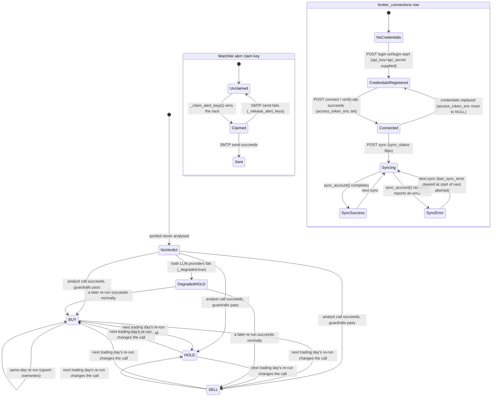

# State Machine

AlphaPulse has no single domain-wide state machine — it is a collection of independent
small-state entities, each with its own transition rule. All below are confirmed against source
by this engagement's business-flow tracing agent.

## States

| State | Allowed transitions | Trigger | Code location | Evidence |
|-------|---------------------|---------|---------------|----------|
| `verdict_history` row (symbol, day) | absent → `{BUY,HOLD,SELL}` (or a safe-fallback `HOLD` with `degraded:true`); same-day re-run overwrites via `ON CONFLICT DO UPDATE` (`signal_score` COALESCEd, not overwritten with a null) | Journey 1 (SSE analysis), Journey 3 (daily watchlist re-check), CLI `main.py` | `backend/analytics/verdict_history.py:33-109` | HIGH (backend-core + business-flow agents both independently read this) |
| Analysis report `degraded` flag | `false` → `true` only when both the primary and (if applicable) failover LLM provider attempts fail | Journey 1 step 8-9 | `backend/analyst/crew.py:658-693,925`; promoted at `main._build_report()` (not independently re-read line-by-line — MEDIUM) | HIGH for crew.py mechanism; MEDIUM for the promotion site |
| `magic_links` row | absent → issued (`used_at IS NULL`) → consumed (`used_at` set, atomically, race-safe) — single-use, never reusable | `POST /api/auth/request-link` → `GET /api/auth/verify` | `backend/auth.py:68-75` (create), `:94-101` (consume) | HIGH (backend-core agent) |
| `sessions` row | issued (30-day TTL) → expired (checked on read, not actively pruned except opportunistically alongside a new magic-link request) → deleted (logout, best-effort) | `GET /api/auth/verify` (issue), `POST /api/auth/logout` (delete) | `backend/auth.py:122-130` | HIGH |
| `api_keys` row | issued (no TTL) → revoked (`revoked_at` set, retained not deleted) | `POST /api/api-keys`, `DELETE /api/api-keys/{id}` | docs/api-reference.md:692-738 (doc-sourced; not independently re-read this engagement — MEDIUM) | MEDIUM |
| `watchlist_alerts_sent` claim key `(user, symbol, kind, date)` | unclaimed → claimed → sent, or claimed → released (SMTP failure) back to unclaimed | `pipelines/watchlist_alerts.py::_claim_alert_keys()`/`_release_alert_keys()` | `pipelines/watchlist_alerts.py:49-82,319` | HIGH (business-flow agent, verified read) |
| `broker_connections` row | `NoCredentials → CredentialsRegistered → Connected → Syncing → {SyncSuccess, SyncError}` (loops back to `Syncing` on next attempt); replacing credentials resets to `CredentialsRegistered` (clears `access_token_enc`) | `POST /broker/{broker}/login-url`, `/connect`, `/login-start`, `/verify-otp`, `/sync` | `backend/routes/broker_sync.py` (P3b + routes/pipelines agents both read this directly); `docs/database.md:772-836` for the full column-level lifecycle | HIGH |
| `valuations` row (asset, day) | absent/stale → fresh (nightly engine, authoritative for mf/stock) or manual entry (any type); same-day edit upserts, new day inserts a new history row | `portfolio_valuation.refresh_valuations()`, `POST /api/portfolio/assets/{id}/valuations` | `backend/portfolio/portfolio_valuation.py:136-151` | HIGH |
| Market-picks pipeline run | `healthy: bool` — not persisted as DB state, a per-run computed flag gating whether the file cache is refreshed | `pipelines/market_picks_pipeline.py` health gates | `market_picks_pipeline.py:920-942` | HIGH |
| Batch pipeline exit state (SME/Screener/EOD/watchlist-alerts) | `run() → True` (job succeeds) / `run() → False` (health gate fails → `SystemExit(1)`, GitHub Actions job fails loudly) | Cron trigger | `sme_ema_pipeline.py:509-517`, `screener_pipeline.py:187-195`, `watchlist_alerts.py:328-333` | HIGH — **`corporate_actions_pipeline.py` was not confirmed to have an equivalent bool health-gate in this engagement's source reading; see `UNKNOWNS.md`** |

## Not a state machine (explicitly out of scope for this artifact)

- `positions`/`watchlist_items` rows have no lifecycle beyond user-driven CRUD — no state field,
  no transitions to model (per `docs/database.md`: "user-driven only, no pruning, no cron, no
  expiry").
- `app_state` is a generic KV store, not a state machine — each namespace's payload shape is
  documented in `DATA_OWNERSHIP.md`, not modeled here.
